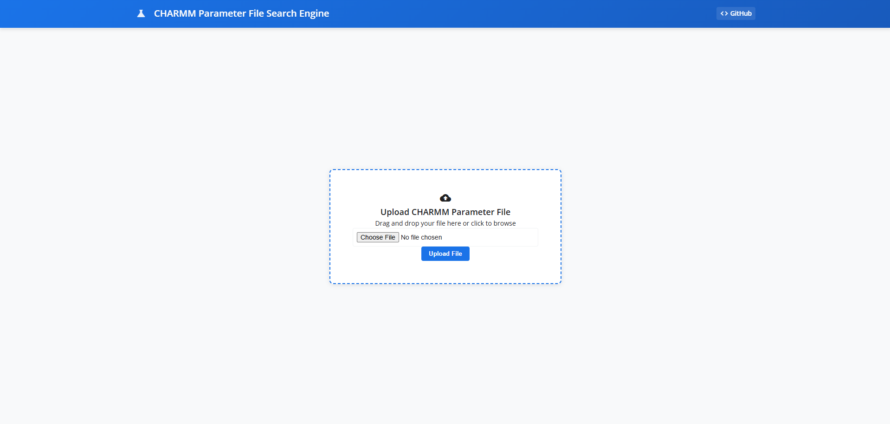

# aider chat started at 2025-01-24 10:17:58

> Add .aider* to .gitignore (recommended)? (Y)es/(N)o [Yes]: y  
> Added .aider* to .gitignore  
> /home/sf2/miniconda3/envs/aider_env/bin/aider  
> Aider v0.64.1  
> Main model: claude-3-5-sonnet-20241022 with diff edit format, infinite output  
> Weak model: claude-3-5-haiku-20241022  
> Git repo: .git with 18 files  
> Repo-map: using 1024 tokens, auto refresh  
> VSCode terminal detected, pretty output has been disabled.  
> Use /help <question> for help, run "aider --help" to see cmd line args  

#### /add *  
> Added .aider.chat.history.md to the chat  
> Added .aider.input.history to the chat  
> /home/sf2/LabWork/Workspace/2-ParseCharrm/SearchUI/.aider.tags.cache.v3/cache.db: 'utf-8' codec can't decode byte 0xf8 in position 102: invalid start byte  
> Use --encoding to set the unicode encoding.  
> Unable to read .aider.tags.cache.v3/cache.db  
> Added .gitignore to the chat  
> Added LICENSE to the chat  
> Added README.md to the chat  
> Added app.py to the chat  
> Added backend/core.py to the chat  
> Added backend/parsers.py to the chat  
> Added backend/tests/__init__.py to the chat  
> Added backend/tests/test_parsers.py to the chat  
> Added backend/tests/test_utils.py to the chat  
> Added backend/utils.py to the chat  
> Added frontend/static/css/main.css to the chat  
> Added frontend/static/js/app.js to the chat  
> Added frontend/templates/index.html to the chat  
> Added frontend/templates/search.html to the chat  
> Added requirements.txt to the chat  

#### /add *  
> .aider.chat.history.md is already in the chat as an editable file  
> .aider.input.history is already in the chat as an editable file  
> /home/sf2/LabWork/Workspace/2-ParseCharrm/SearchUI/.aider.tags.cache.v3/cache.db: 'utf-8' codec can't decode byte 0xf8 in position 102: invalid start byte  
> Use --encoding to set the unicode encoding.  
> Unable to read .aider.tags.cache.v3/cache.db  
> .gitignore is already in the chat as an editable file  
> LICENSE is already in the chat as an editable file  
> README.md is already in the chat as an editable file  
> app.py is already in the chat as an editable file  
> backend/core.py is already in the chat as an editable file  
> backend/parsers.py is already in the chat as an editable file  
> backend/tests/__init__.py is already in the chat as an editable file  
> backend/tests/test_parsers.py is already in the chat as an editable file  
> backend/tests/test_utils.py is already in the chat as an editable file  
> backend/utils.py is already in the chat as an editable file  
> frontend/static/css/main.css is already in the chat as an editable file  
> frontend/static/js/app.js is already in the chat as an editable file  
> frontend/templates/index.html is already in the chat as an editable file  
> frontend/templates/search.html is already in the chat as an editable file  
> requirements.txt is already in the chat as an editable file  

#### /add *  
> .aider.chat.history.md is already in the chat as an editable file  
> .aider.input.history is already in the chat as an editable file  
> /home/sf2/LabWork/Workspace/2-ParseCharrm/SearchUI/.aider.tags.cache.v3/cache.db: 'utf-8' codec can't decode byte 0xf8 in position 102: invalid start byte  
> Use --encoding to set the unicode encoding.  
> Unable to read .aider.tags.cache.v3/cache.db  
> .gitignore is already in the chat as an editable file  
> LICENSE is already in the chat as an editable file  
> README.md is already in the chat as an editable file  
> app.py is already in the chat as an editable file  
> backend/core.py is already in the chat as an editable file  
> backend/parsers.py is already in the chat as an editable file  
> backend/tests/__init__.py is already in the chat as an editable file  
> backend/tests/test_parsers.py is already in the chat as an editable file  
> backend/tests/test_utils.py is already in the chat as an editable file  
> backend/utils.py is already in the chat as an editable file  
> frontend/static/css/main.css is already in the chat as an editable file  
> frontend/static/js/app.js is already in the chat as an editable file  
> frontend/templates/index.html is already in the chat as an editable file  
> frontend/templates/search.html is already in the chat as an editable file  
> Added imgs/Initial_Upload.png to the chat  
> Added imgs/Search_Engine.png to the chat  
> requirements.txt is already in the chat as an editable file  
> Added uploads/IFF_CHARMM36_parameters_V4/ANGLES.csv to the chat  
> Warning: it's best to only add files that need changes to the chat.  
> https://aider.chat/docs/troubleshooting/edit-errors.html  
> Added uploads/IFF_CHARMM36_parameters_V4/ATOMS.csv to the chat  
> Added uploads/IFF_CHARMM36_parameters_V4/BONDS.csv to the chat  
> Added uploads/IFF_CHARMM36_parameters_V4/DIHEDRALS.csv to the chat  
> Added uploads/IFF_CHARMM36_parameters_V4/IFF_CHARMM36_parameters_V4.txt to the chat  
> Added uploads/IFF_CHARMM36_parameters_V4/IMPROPER.csv to the chat  

#### /drop uploads/*  
> Removed uploads/IFF_CHARMM36_parameters_V4/ATOMS.csv from the chat  
> Removed uploads/IFF_CHARMM36_parameters_V4/BONDS.csv from the chat  
> Removed uploads/IFF_CHARMM36_parameters_V4/ANGLES.csv from the chat  
> Removed uploads/IFF_CHARMM36_parameters_V4/DIHEDRALS.csv from the chat  
> Removed uploads/IFF_CHARMM36_parameters_V4/IMPROPER.csv from the chat  
> Removed uploads/IFF_CHARMM36_parameters_V4/IFF_CHARMM36_parameters_V4.txt from the chat  

#### added images as png files can we add them to the README so they show up properly  

I'll help add the screenshots to the README.md file. I'll add them in a new section after the key features to showcase the interface.

README.md
<source>
<<<<<<< SEARCH
## Key Features

### File Management
=======
## Key Features

### Interface Screenshots

#### Initial Upload Screen

#### Search Interface

### File Management
>>>>>>> REPLACE
</source>

This will add the screenshots with descriptive captions in a new section right after the Key Features introduction. The images will be displayed in order showing the workflow from initial upload to search interface.

The relative paths used (imgs/Initial_Upload.png and imgs/Search_Engine.png) will work as long as the images are stored in an "imgs" directory at the root of your repository.

> Tokens: 25k sent, 172 received. Cost: $0.08 message, $0.08 session.  
> Applied edit to README.md  
> Commit c4351cc docs: Add interface screenshots to README  
> You can use /undo to undo and discard each aider commit.  
