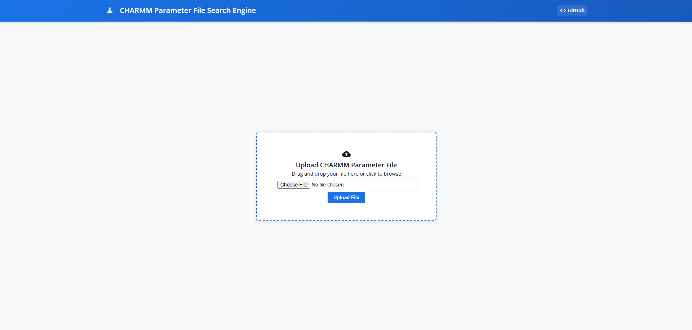
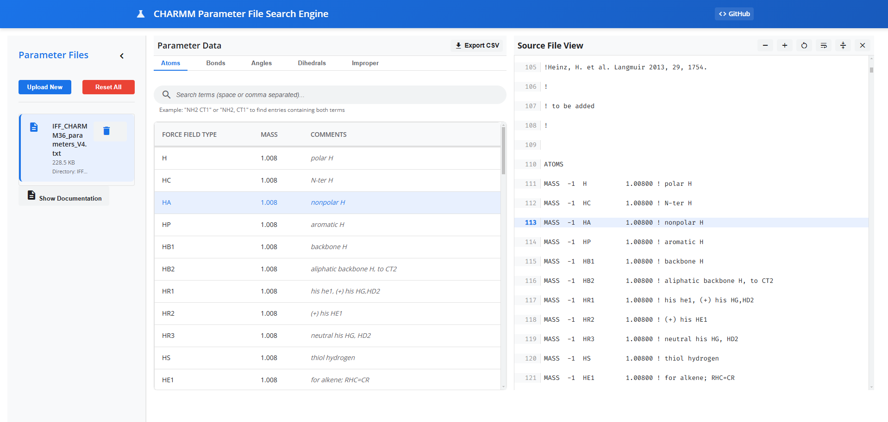

# CHARMM Parameter File Search Engine

A web-based application for parsing, viewing, and analyzing CHARMM parameter files with an intuitive user interface. This tool provides a modern, interactive interface for researchers and developers working with CHARMM parameter files.

## Key Features

### Interface Screenshots

#### Initial Upload Screen


#### Search Interface


### File Management
- Upload CHARMM parameter files via drag-and-drop or file browser
- Multi-file support with individual file management
- Secure file handling with automatic directory creation
- File deletion and system reset capabilities

### Data Processing
- Automatic parsing of CHARMM parameter file sections:
  - ATOMS
  - BONDS
  - ANGLES
  - DIHEDRALS
  - IMPROPER
- Preservation of comments and metadata
- Line number tracking for source reference

### User Interface
- Split-view interface with data table and source file viewer
- Collapsible sidebar for file management
- Material Design icons and modern styling
- Responsive layout adapting to screen sizes

### Data Visualization
- Interactive data tables with sorting capabilities
- Section-based organization with tabbed interface
- Real-time search filtering across all columns
- Highlighted line references between table and source

### Export Features
- CSV export for individual sections
- Preserved data formatting and comments
- Structured file naming for exports

### Source File Viewer
- Syntax-highlighted parameter file display
- Line numbering with reference highlighting
- Text size controls (zoom in/out)
- Word wrap toggle
- Quick navigation to referenced lines

### Search Capabilities
- Real-time filtering within sections
- Multi-term search support
- Case-insensitive matching
- Support for partial word matches

## Technical Features

### Frontend
- Modern responsive design using CSS Grid and Flexbox
- Custom scrollbar styling for better usability
- Material Icons integration
- Fira Code monospace font for parameter display
- Animated transitions and hover effects
- Cross-browser compatibility
- Mobile-friendly interface

### Backend
- Flask-based RESTful API
- Pandas for data processing and analysis
- Secure file upload handling
- Automatic file organization
- CSV generation capabilities
- Error handling and validation
- Type hints and documentation

### Performance
- Efficient file parsing algorithms
- Optimized data storage
- Quick search and filter operations
- Responsive UI with minimal loading times
- Memory-efficient data handling

## System Requirements

- Python 3.8 or higher
- pip (Python package installer)
- Modern web browser (Chrome, Firefox, Safari, or Edge)
- Git (for version control)

## Installation

1. Clone the repository:
```bash
git clone https://github.com/fl-sean03/CHARMM-Parameter-File-Search-Engine.git
cd charmm-parameter-search
```

2. Create and activate a virtual environment (recommended):
```bash
python -m venv venv
source venv/bin/activate  # On Windows: venv\Scripts\activate
```

3. Install required dependencies:
```bash
pip install -r requirements.txt
```

## Usage

1. Start the Flask application:
```bash
python app.py
```

2. Open your web browser and navigate to:
```
http://localhost:5000
```

3. Upload a CHARMM parameter file:
   - Drag and drop files into the upload area
   - Click to browse and select files
   - Supported formats: .txt, .par

4. View and analyze data:
   - Switch between different sections using tabs
   - Download specific sections as CSV files
   - Delete or reset files as needed

## Project Structure

```
charmm-parameter-search/
├── app.py                 # Flask application main file
├── backend/
│   ├── core.py           # Core processing logic
│   ├── parsers.py        # File parsing functionality
│   ├── utils.py          # Utility functions
│   └── tests/            # Test files
├── frontend/
│   ├── static/
│   │   ├── css/         # Stylesheets
│   │   └── js/          # JavaScript files
│   └── templates/        # HTML templates
├── uploads/              # Directory for uploaded files
├── requirements.txt      # Project dependencies
├── LICENSE              # License information
└── README.md            # Project documentation
```

## API Endpoints

### Main Endpoints
- `GET /`: Main application interface
- `POST /upload`: Upload parameter files
- `POST /delete`: Delete uploaded files
- `POST /reset`: Reset all uploaded files
- `POST /get_file_data`: Get parsed data for a specific file
- `GET /download_csv/<section>/<dir>`: Download section data as CSV

### Response Formats
All API endpoints return JSON responses with the following structure:
```json
{
    "message": "Success/Error message",
    "data": {
        "section_name": [...],
        ...
    }
}
```

## Development

### Setting Up Development Environment

1. Install development dependencies:
```bash
pip install -r requirements-dev.txt
```

2. Run in development mode:
```bash
export FLASK_ENV=development
export FLASK_APP=app.py
flask run
```

### Code Style
- Follow PEP 8 guidelines
- Use type hints for function parameters
- Document functions using docstrings
- Keep functions focused and single-purpose

## Testing

### Running Tests
```bash
python -m pytest backend/tests/
```

### Test Coverage
```bash
python -m pytest --cov=backend tests/
```

## Contributing

1. Fork the repository
2. Create a feature branch (`git checkout -b feature/AmazingFeature`)
3. Commit your changes (`git commit -m 'Add some AmazingFeature'`)
4. Push to the branch (`git push origin feature/AmazingFeature`)
5. Open a Pull Request

### Pull Request Guidelines
- Include a clear description of changes
- Add tests for new features
- Update documentation as needed
- Ensure all tests pass
- Follow the existing code style

## Troubleshooting

### Common Issues
1. **Upload Errors**
   - Ensure file format is supported (.txt, .par)
   - Check file size limits
   - Verify file permissions

2. **Parser Errors**
   - Validate CHARMM parameter file format
   - Check for file encoding issues
   - Ensure complete section headers

3. **Server Issues**
   - Verify Python version compatibility
   - Check all dependencies are installed
   - Ensure proper file permissions in uploads directory

## Security

- Input validation for all file uploads
- Secure file handling and storage
- Protection against common web vulnerabilities
- Regular security updates and patches

## License

This project is licensed under the MIT License - see the LICENSE file for details.

## Acknowledgments

- CHARMM Parameter File Format Documentation
- Flask Web Framework
- Pandas for Data Processing
- Material Icons for UI elements
- Open Source Community

## Version History

- v1.0.0 (2024-01-23)
  - Initial release
  - Basic file parsing functionality
  - Web interface implementation
  - CSV export capability

## Contact

Project Link: https://github.com/fl-sean03/CHARMM-Parameter-File-Search-Engine

## Citation - In Progress

If you use this software in your research, please cite:

```bibtex
@software{charmm_parameter_search,
  author = {Your Name},
  title = {CHARMM Parameter File Search Engine},
  year = {2024},
  url = {https://github.com/yourusername/charmm-parameter-search}
}
```
